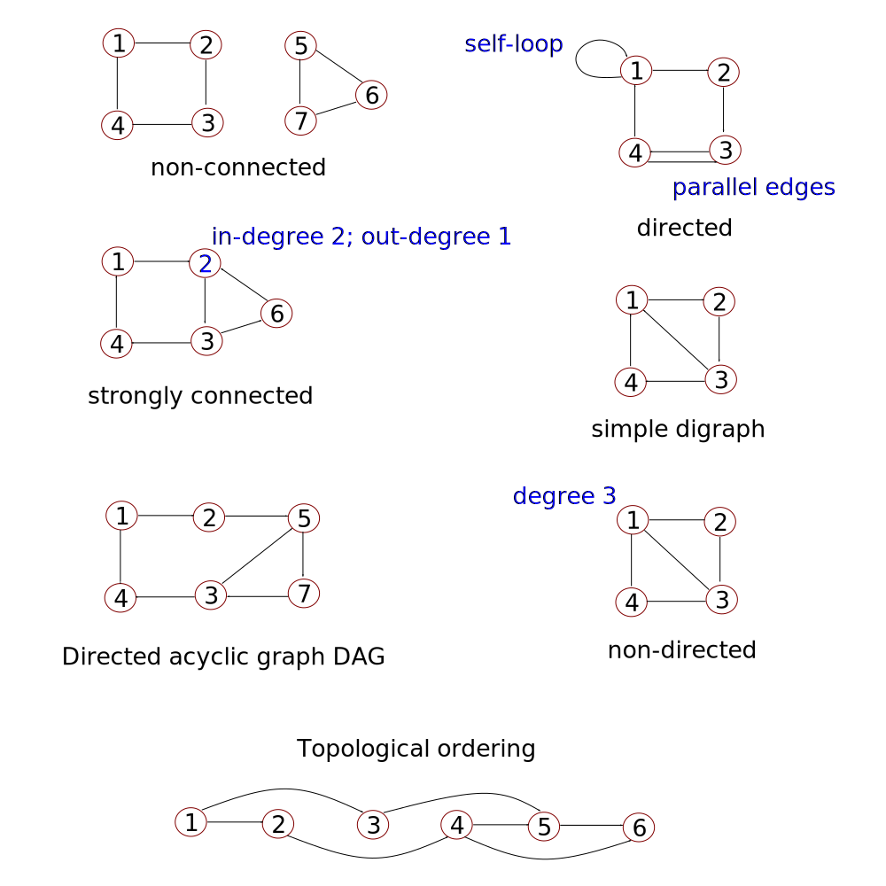
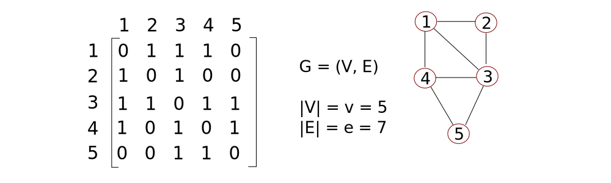
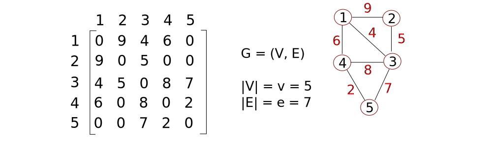
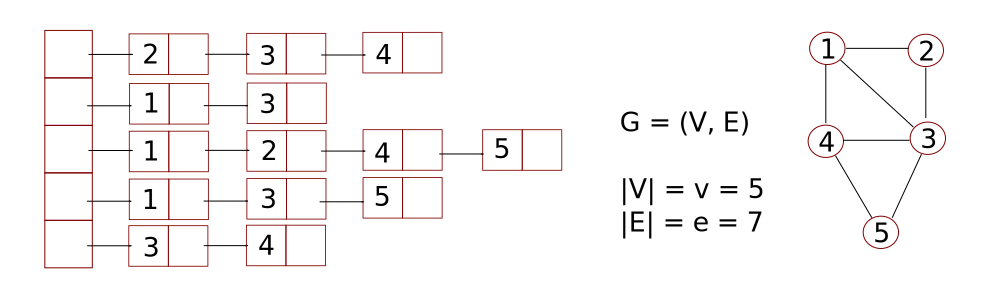
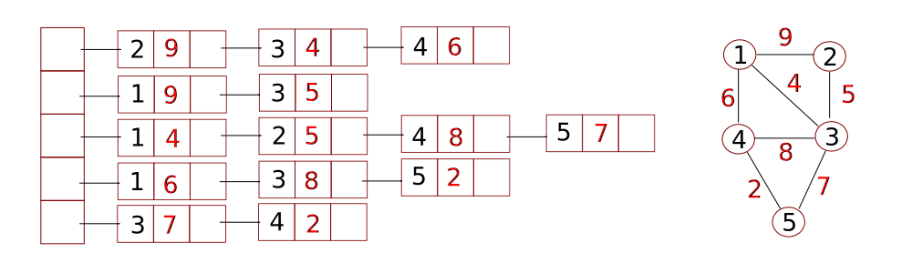
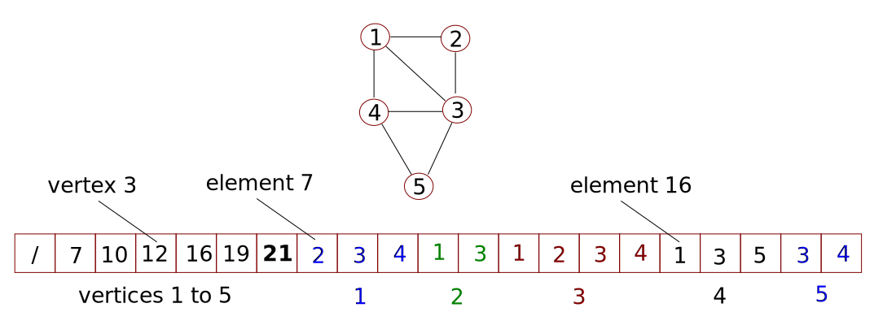
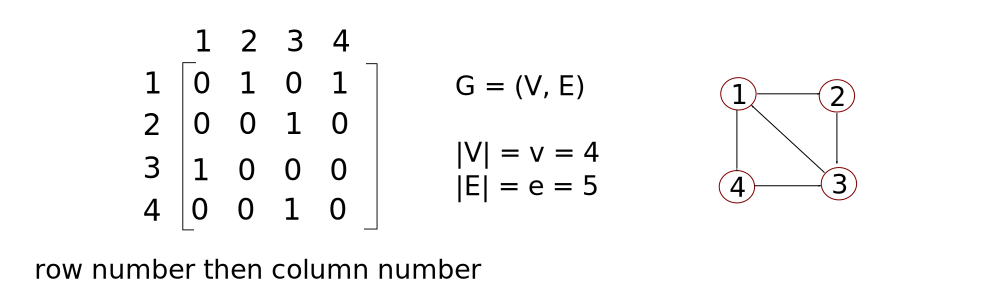
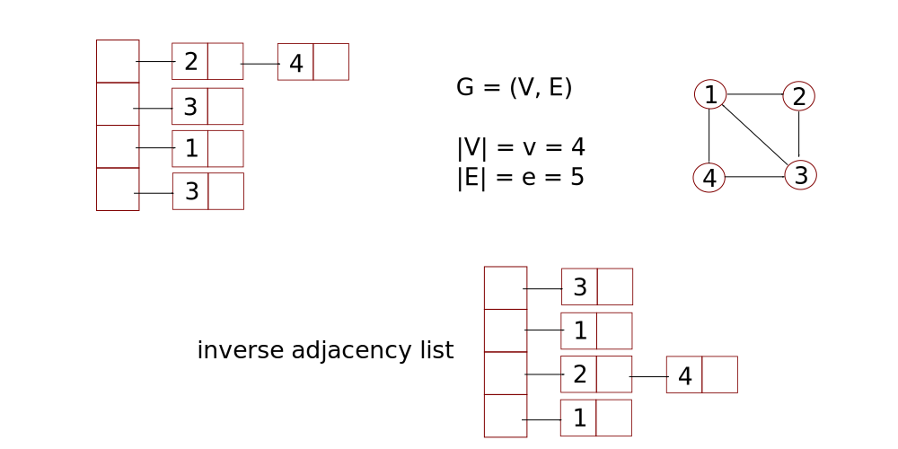
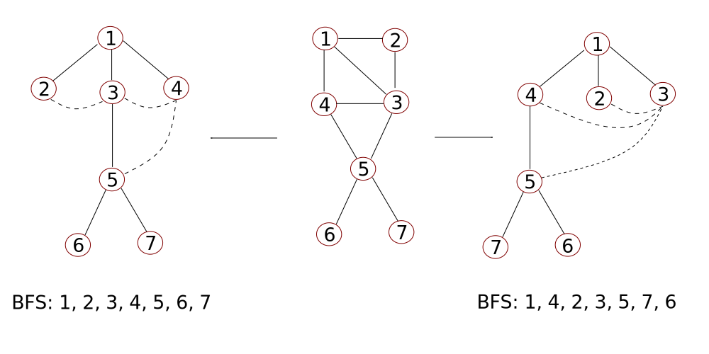
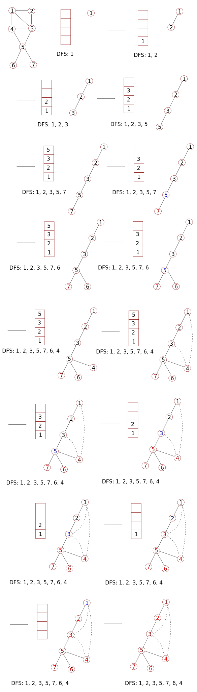

# Graphs #

Graphs are made up of vertices and edges, and expressed as `G(V, E)`.



Directed graphs have directed edges (outcoming one vertex and incoming to another). Two edges with opposing direction between the same vertices are parallel edges. Graphs which are not made up of self-loop(s) or parallel edges are known as _simple_ digraphs, in which a digraph is a _directed_ graph. When a graph is simply referred to as a graph then it is assumed to be non-directed. Graphs made up of two or more components are known as non-connected graph.

Vertices, which when removed, result in two or more components are known as _articulation points_ (none of the above graphs contain articulation points). Graphs which do not have any articulation points are sometimes referred to as _connected graphs_.

A graph is termed _strongly connected_ when there is a path between any two nodes. A _path_ is a set of all vertices in between two vertices. Paths are cyclic (or circular) if it traverses to and from the same vertex.

Graphs in which all edges are directed in the same direction then the graph is termed _topological_.

## Representing undirected graphs ##

### Adjacency matrix ###



The dimensions of the matrix above matches the vertices in the graph. One could also include a zero-based row and column to represent the zeroth element if desired (thus the matrix would be (n+1) by (n+1)). The values in the zeroth row and column can take any value, they would be ignored at run-time.

The graph vertices correspond to the row (i) and column (j) numbers of the matrix. Start with the row number (the starting vertex) and find the column number (the final vertex), or, vice versa, working from a column number and then to a row number.

The elements in the matrix denote if there is one edge present. For a matrix A, then `A[i][j] = 1` when there is one edge between vertices `i` and `j`, and `A[i][j] = 0` otherwise. 

It follows that `A[i][i] = 0` in all cases, except for self-loops (some implementations assign infinity instead of zero). Also see how the matrix is symmetric.

As will be demonstrated, algorithms generally have to process all elements in the matrix to verify that graph structure. Therefore, time complexities are O(n^2).

### Cost adjacency matrix (of Weighted graphs) ###




### Adjacency list ###

This representation is essentially an array of linked lists. Each element in the array represents a given vertex and the linked list lists the connected vertices (listed in ascending order). Assume here that vertex "1" is given by the zeroth element, vertex "2" is given by the first element and so on.



Algorithms generally access all vertices `v` and proceed along a path `e` twice (from 1 to 2, and 2 to 1). Hence the time complexity would be `O(v + 2e)` or just `O(v + e)`.

### Cost adjacency list ###



### Compact list ###

This representation uses a single-dimensioned array. In this case, we require space for each vertex, two spaces per edge and a spare element to set the zeroth element as `NULL` and enable vertex number to equal the element number.

Elements 1 to n represent the first vertex index connected to vertices n. Element `n+1` is the first out-of-bounds index (in the case below, element 21) and separates the origin vertices from the neighbouring vertices.



The space complexity of compact lists is `O(v + 2e + 1)`, which is effectively O(n).

## Representing directed graphs ##

### Adjacency matrix ###

The approach to representing a directed graph follows similarly to an undirected graph, with a matrix. The counting of edges is incremented by considering the direction of the edge. One reads the row number followed by the column number. Note that the matrix need not be symmetric.



Reading from row to column shows one the edges moving out of the vertex given by the row number. Reading from column to row reveals the edges coming into the vertex given by the row number. As a result, the in-degree of a vertex given by the column number is the sum of the elements in the same column. The out-degree of a vertex given by a given row number is the sum of the elements in the same row.

The space complexity of adjacency matrices is `O(n x n)`, or just O(n^2).

### Adjacency list ###

Like adjacency matrices, adjacency lists consider direction. The number of nodes in each linked list is typically lower for directed graphs compared to undirected graphs.



The out-degree is the sum of nodes present in a given linked list corresponding to the vertex in question. To determine the in-degree of a vertex, one would need to process the entire array and tally the number of times the vertex in question appears in the array of linked lists.

Calculating the in-degree is more time consuming. If the in-degree is an important value to derive then one can build an _inverse adjacency list_ and present the nodes which point to a given vertex.

The space complexity of compact lists is `O(v + e)`, which is effectively O(n). Algorithms discussed here tend to use adjacency lists instead of adjacency matrices.

### Compact list ###

A compact list for a directed graph is similar to that for an undirected graph. The groups of vertices which are connected to the primary vertices (element 1 to n) list elements pointed to by the primary values. It is also possible to build an analogous 'inverse compact list' where instead the groups of vertices represent vertices which point to the primary vertices.

## Breadth first search BFS ##

BFS is similar to level-order of a tree. First one re-draws the graph as a tree like structure, where the edges in the graph and tree are equal and match. Process the edges required in any logical order with each vertex (value). 

A dotted edge is used to represent edges already present in the graph but are not drawn in the conventional tree structure way. Hiding the dotted edges shows that data structure as a tree.



Then take the level-order traversal of the 'tree' to find the BFS sequence. The results of BFS can vary depending on how the graph was re-drawn. 

Additionally, we used vertex `1` as the starting point. This is not a requirement and any other vertex can be used as a starting vertex. Note, dotted lines can cross solid lines if needed. What is important is that in _visiting_ each intermediate child node of the growing tree, one _explores_ each adjacent vertex completely. The order of exploring (visiting all adjacent vertices) vertices can vary and is arbitrary. One can start from an internal vertex if desired.

The sequence lists the vertices visited. 

1. After a vertex is visited, add the vertex to a queue.
2. Take a vertex out of the queue and _explore_ it.
3. When a vertex is visited, add it to the queue and the BFS sequence. If the vertex has already been visited before, do not add it to the queue or BFS sequence and instead move to the next vertex.
4. Repeat the steps 1-3 once a vertex has been _completely explored_.

Once the graph has been processed, the queue should be empty, and BFS ends.

The resultant trees produced from a BFS search are known as _BFS spanning trees_. The dotted edges are referred to as _cross edges_. In this BFS example, the cross edges only link vertices in the same or adjacent (tree) level.

The time complexity of BFS is O(n). The _exploration_ of a vertex is not considered when analysing time complexity.

### BFS algorithm ###

The ADTs needed are a queue for the vertices currently being explored and an array (initially padded with zeros) showing which vertices have already been visited. The graph, in this case, is represented by an adjacency matrix.

```cpp
//initialise queue q and array visited globally

void breadthFirstSearch(int i){
    //u and v are row and column pointers, respectively
    int u, v;

    printf("%d ", i);
    visited[i] = 1;
    enqueue(q, i);

    while(!isEmpty(q)){
        u = dequeue(q);
        for (v = 1; v <= n; v++){
            //process each row of a adjacency matrix, advancing the column pointer each time
            if (A[u][v] == 1 && visited[v] == 0){
                printf("%d ", v);
                visited[v] = 1;
                enqueue(q, v);
            }
        }
    }

}
```

The while loop will run (n-1) times and the inner for loop runs `n` times, so the time complexity is O(n^2), at worst.

## Depth first search DFS ##

DFS is similar to pre-order traversal of tree structures.

1. Pick _any_ starting vertex, set it as visited.
2. Pick _any_ adjacent vertex, set it as visited.
3. Suspend the exploration of the (new) vertex from step 1. Instead, push it into a stack.
4. If available, pick any (other*) vertex adjacent to the vertex from step 2. Set the vertex as visited.
5. Regarding vertex from step 4:
  + If there are vertices adjacent to the vertex from step 4, suspend the exploration of the vertex from step 4 and push it to the stack.
  + If there are no other vertices adjacent to the vertex from step 4, then pop the vertex from step 3 and continue with other adjacent vertices starting from step 3.
 
An example of DFS is outlined below. Notice how part of the DFS sequence resembles the stack, the ordering of the values of which directs future visit checks.



The above tree is referred to as a _DFS spanning trees_. The dotted lines are known as _back edges_, termed as such since they are drawn to connect 'backwards' to a vertex (compare these to cross edges).

The time taken to build a DFS spanning tree is O(n), since we visit new vertices and explore then once. The time complexity of DFS, like BFS, depends on the representation used (adjacency matrix, adjacency list or compact list).

DFS and BFS searches emphasise on visiting all vertices and are not concerned with the resultant sequences (which all differ).

In the example below, a (n+1) by (n+1) adjacency matrix represents the graph, along with a stack and array 'visited'.

```cpp
void depthFirstSearch(int u){
    if (visited[u] == 0){
        printf("%d ", u);
        visited[u] = 1;
        for (int v = 0; v <= n; v++){
            //if there is an edge between vertices u and v, and it has not been visited yet
            if (A[u][v] == 1 && visited[v] != 0){
                depthFirstSearch(v);
            }
        }
    }
}
``` 